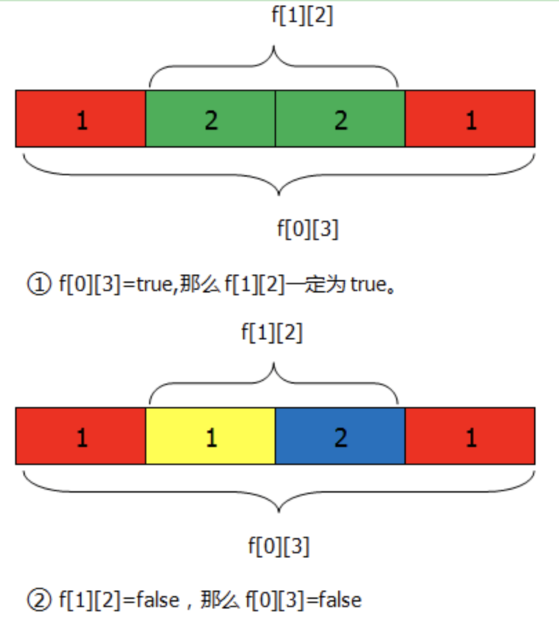
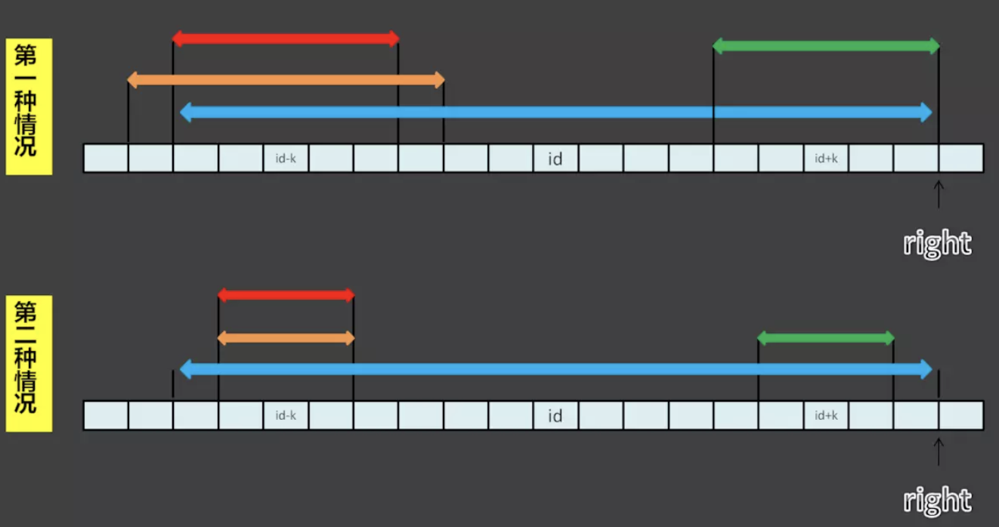

　　主要记录字符串相关的题目。

[TOC]

### 3 [最长非重复子字符串](../java/com/ckm/string/Solution3.java)
问题描述：

　　给定一个字符串，返回该字符串中非重复字符子串的最大长度。

示例：

示例 1:

```
Input: "abcabcbb"
Output: 3 
Explanation: 最长非重复子串为 "abc", 长度 3. 
Example 2:

Input: "bbbbb"
Output: 1
Explanation: 最长非重复子串为 "b", 长度 1.
Example 3:

Input: "pwwkew"
Output: 3
Explanation: 最长非重复子串为 "wke", 长度 3. 
```

解法：

　　1、遍历一次字符串，维护一个<字符, index>的map结构，当遇到重复字符时，计数归零，新计数起点值为两个相同字符之间字符的个数。
需要注意`abba`这种结构，第一个`a`出现在`b`之前，此时新的计数起点只能从第二个`b`开始。

　　2、维护一个滑动窗口`[i, j)`，该窗口中的元素全部不相同。维护一个`Set`记录不同的字符，每次使`j`向后移动一位，当新字符第一次出现，则`j`继续向后移动,
否则从`i`开始移除`Set`中的元素，直到不再出现重复元素为止。然后继续移动`j`，直到`i`和`j`都遍历完全部元素。

### 5 [寻找字符串的最大回文子串](../java/com/ckm/string/Solution5.java)
问题描述：

　　如题

示例：

```
Example 1:

Input: "babad"
Output: "bab"
Note: "aba" is also a valid answer.
Example 2:

Input: "cbbd"
Output: "bb"
```

解法：

　　(1) 反转原字符串后，求两个字符串的最长公共子序列

　　(2) 回文字符串关于某个字符左右对称。所以，判断字符串是否为回文时可以从某个字符向两边扩展进行判断。对于`aba`和`abba`这种字符数分为奇偶的情况，有一种快捷方法，即对字符串进行扩展，
如`#a#b#a#`或者`#a#b#b#a#`，在整个字符串开头和结尾，以及每个字符中间都加上`#`，就可以对任意长度字符串进行同样的处理逻辑。

　　(3) 动态规划。

　　如果父串位回文，那么里面的子串也必为回文，否则不成立。如下图所示：



　　递推公式如下，其中`S[i]`和`S[j]`是字符串`S`中的字符：

 i + 1\end{cases}" />

　　(4) Manacher算法

　　与方法2类似，首先对原字符串进行扩充，统一奇偶字符数时的处理逻辑。接下来利用回文串的特性求解。

　　如下图所示，每次向后遍历一个字符，使用变量`right`记录当前所遍历的字符为中心的回文子串所能触及的最右边界，与该边界对应的字符下标为`id`，则距离该下标`k`并且关于下标对称的两个字符分别为
`id - k`和`id + k`。以`rad[]`记录各字符为中心的最大回文串半径。

　　在第一种情况下，`id - k`已经遍历过，以它为中心的最大回文串半径超出了以`id`为中心的最大回文串半径时，即`rad[id - k] > rad[id] - k`表示图中橙色超出蓝色的长度。在这种情况下，
关于`id`对称的点`id + k`的边界会超出`right`，此时临时记录`rad[id + k]`的值为`id + k`到`right`的距离，即`rad[id] - k`。然后超出`right`的部分，同时从字符串两端向外扩展，
如果两端字符相同，则逐步增加`rad[id + k]`的值，同时更新`id = id + k`，并且增大`right`。

　　在第二种情况下，`id - k`的回文串在以`id`为中心的回文串中包含，此时`rad[id + k] = rad[id - k]`。

　　综上两种情况，`rad[id + k] = Min(rad[id - k], rad[id] - k)`。在代码中表达为`Math.min(rad[2 * id - i], rad[id] - (i - id))`，其中`i - id`为当前遍历的点`i`距离`id`中心的距离`k`。



### 6 [ZigZag字符转换](../java/com/ckm/string/Solution6.java)
问题描述：

　　字符串"PAYPALISHIRING"是按照`|/|`形排列的，即首先从上往下依次显示字符，然后斜向上到顶后继续第二列从上往下。如下所示，
  
  P   A   H   N
  A P L S I I G
  Y   I   R

　　排列好后按行读取字符并形成新的字符串，"PAHNAPLSIIGYIR"。
  
　　代码接收一个字符串参数，以及整数的行数，实现字符串的zigzag排列。

示例：

```
  Example 1:
  
  Input: s = "PAYPALISHIRING", numRows = 3
  Output: "PAHNAPLSIIGYIR"
  Example 2:
  
  Input: s = "PAYPALISHIRING", numRows = 4
  Output: "PINALSIGYAHRPI"
  Explanation:
  
  P     I    N
  A   L S  I G
  Y A   H R
  P     I
```

解法：

　　对于`n`行的zigzag字符，可以用`n + (n - 2)`为一组，每组占`1 + (n - 2)`列，字符串总字符数除以每组的元素个数即可得到总共的组数，然后乘以列数，就可以构造出一个二维数组。

　　遍历字符串，按从上往下的顺序设置数组后，再按从左至右的顺序依次读取。没有字符的地方用空字符串表示。

### 8 [字符串转数字](../java/com/ckm/string/Solution8.java)
问题描述：

　　输入一个字符串，从前往后遍历字符，直到第一个非空格为止。起始字符可以是数字，也可以是`+/-`符号。后续连续取数字字符，作为返回的结果。
在数字之后可以继续写入字符。

　　需要注意的是，如果第一个非空格不是数字或者`+/-`符号，则返回`0`。如果整数范围。超出部分返回`INT.MAX`或者`INT.MIN`。

示例：

```
Example 1:

Input: "42"
Output: 42

Example 2:

Input: "   -42"
Output: -42
Explanation: 第一个非空格字符是'-', 表示负号。结果为-42。

Example 3:

Input: "4193 with words"
Output: 4193
Explanation: 最后一个数字为3，后面的字符略。

Example 4:

Input: "words and 987"
Output: 0
Explanation: 第一个非空格为'w', 不是数字也不是+/-符号，因此返回0。

Example 5:

Input: "-91283472332"
Output: -2147483648
Explanation: 数字"-91283472332"越界，返回`INT_MIN`
```

解法：

　　略，看代码

### 10 [正则表达式匹配](../java/com/ckm/string/Solution10.java)
问题描述：

　　输入一个字符串和一个正则表达式，返回该字符串是否符合正则表达式的匹配。

　　正则表达式中的`.`表示任意字符，`*`表示0个或多个字符。只考虑小写字符，并且只判断正则表达式是否与整个字符串是否匹配。

示例：

```
Example 1:

Input:
s = "aa"
p = "a"
Output: false
Explanation: 表达式"a"无法匹配"aa"

Example 2:

Input:
s = "aa"
p = "a*"
Output: true
Explanation: "*"表示若干个字符。

Example 3:

Input:
s = "ab"
p = ".*"
Output: true
Explanation: ".*"表示若干个任意字符

Example 4:

Input:
s = "aab"
p = "c*a*b"
Output: true
Explanation: "c"可出现0次或多次，"a"出现若干次，所以匹配成功

Example 5:

Input:
s = "mississippi"
p = "mis*is*p*."
Output: false
```

解法：

1、递归

　　计算`s(i, j)`是否能够被`p(m, n)`匹配，可以拆分为计算`s(i)`是否匹配`p(m)`，以及`s(i + 1, j)`是否匹配`p(m + 1, n)`。在这个过程中，子问题可能有以下几个状态：
- `s(i) == p(m)`，只需要判断`s(i + 1, j)`和`p(m + 1, n)`是否成立
- `p(j) == '.'`，需要判断`s(i + 1, j)`和`p(m + 1, n)`
- `p(j + 1) == '*' && s(i) != p(j)`，需要判断`s(i, j)`和`p(m + 2, n)`
- `p(j + 1) == '*' && s(i) == p(j)`，需要判断`s(i + 1, j)`和`p(m, n)`

　　对于上面的第三种和第四种情况，`*`可表示0个或多个字符，所以，如果表示0个时，判断`p(m + 2, n)`是否匹配，如果表示1个以上，那么接下来判断`s(i + 1, j)`。

3、动态规划

　　使用一个二维数组记录字符串`s`和模式`p`的匹配情况，`dp[i][j]`表示`s[0, i - 1]`是否与`p[0, j - 1]`相匹配。
（1）初始化
　　布尔数组初始化值全为`false`，需要进行一些必要的初始化。按照对`dp`的定义，`dp[0][0]`表示字符串`s`和`p`都为空字符串，`dp[0][j]`表示字符串`s`为空，但`p`不为空，`dp[i][0]`表示字符串`s`不为空，但`p`为空。

　　两个空字符串是可以匹配的，所以`dp[0][0] = true`。空`s`是可以和`p`的一部分匹配的，当`p[j - 1] == '*'`时，`dp[0, j - 1] = dp[0, j - 2]`，否则`dp[0, j - 1] = false`。
当`p`为空时，全部为`false`，无需初始化。

（2）动态规划
　　

### 13 [罗马数字转数字](../java/com/ckm/string/Solution13.java)
问题描述：

　　给定一个罗马数字符号表示的数字，将其转换为阿拉伯数字。

示例：

```
Example 1:
Input: "III"
Output: 3

Example 2:
Input: "IV"
Output: 4

Example 3:
Input: "IX"
Output: 9

Example 4:
Input: "LVIII"
Output: 58
Explanation: L = 50, V= 5, III = 3.

Example 5:
Input: "MCMXCIV"
Output: 1994
Explanation: M = 1000, CM = 900, XC = 90 and IV = 4.
```

解法：

　　略

### 14 [字符串最长公共前缀](../java/com/ckm/string/Solution14.java)
问题描述：

　　找出若干字符串的最长公共字符串前缀序列，如果没有则返回""。给定字符串只由小写字母`a-z`组成。

示例：

```
Example 1:
Input: ["flower","flow","flight"]
Output: "fl"

Example 2:
Input: ["dog","racecar","car"]
Output: ""
```

解法：

　　（1）暴力解法

　　找到最短字符串的长度，依次遍历各字符串，字符全部相同则拼接到结果中，否则结束遍历。

　　（2）遍历查找

　　遍历全部字符串，查找第一个第二个字符串的公共子串后，再查找公共子串与第三个字符串的公告子串。

　　（3）分治

　　分治主要是基于上面的遍历查找，原问题，计算`LCP(S1, S2, ..., Sn)`可以拆解成`LCP(S1, Smid)`和`LCP(Smid, Sn)`即分成两个部分。
最后再将这两部分的结果聚合一下即可。

### 17 [](../java/com/ckm/string/Solution17.java)
问题描述：

　　给定一个由数字`2~9`组成的字符串，返回九宫格键盘上所有字母可能组成的字符串组合。九宫格键盘如下所示，


示例：

```
Input: "23"
Output: ["ad", "ae", "af", "bd", "be", "bf", "cd", "ce", "cf"].
```

解法：

　　递归，从头到尾遍历输入字符串，解析每一个字符，该字符代表的符号依次与剩余字符串拼接。

### 32 [最长有效括号](../java/com/ckm/string/Solution32.java)
问题描述：

　　给定一个只包含'('和')'组成的字符串，找到其中括号能够正常匹配的最长子字符串。

示例：

```
Example 1:

Input: "(()"
Output: 2
Explanation: The longest valid parentheses substring is "()"

Example 2:

Input: ")()())"
Output: 4
Explanation: The longest valid parentheses substring is "()()"
```

解法：

　　动态规划

### 44 [正则表达式匹配](../java/com/ckm/string/Solution44.java)
问题描述：

　　给定一个字符串，以及一个正则表达式，判断该正则表达式是否可以匹配字符串。正则表达式目前只包含'?'和'*'。与题目10相比，多了一个匹配符号?。

- '?' 匹配任意单个字符
- '*' 匹配字符串，可以为空字符串

约束:
s 可以为空，并且只包含小写字母a-z.
p 可以为空，并且只包含小写字母a-z，以及?或者*。

示例：

```
Example 1:
Input:
s = "aa"
p = "a"
Output: false
Explanation: "a" does not match the entire string "aa".

Example 2:
Input:
s = "aa"
p = "*"
Output: true
Explanation: '*' matches any sequence.

Example 3:
Input:
s = "cb"
p = "?a"
Output: false
Explanation: '?' matches 'c', but the second letter is 'a', which does not match 'b'.

Example 4:
Input:
s = "adceb"
p = "*a*b"
Output: true
Explanation: The first '*' matches the empty sequence, while the second '*' matches the substring "dce".

Example 5:
Input:
s = "acdcb"
p = "a*c?b"
Output: false
```

解法：

　　动态规划，`fn[i][j]`表示给定长度`i`的字符串是否被给定长度的`j`所匹配。那么，递推关系式

　　当`s[i] = p[j]`，即当前遍历的字符串和模式的字符相等，只需要看之前的字符是否能够正常匹配即可，`fn[i][j] = fn[i - 1][j - 1]`

　　当`s[i] != p[i]`时，需要看以下几种可能的情况，

- `p[i] != * && p[i] != ?`时，`fn[i][j] = false`
- `p[i] = ?`时，`fn[i][j] = fn[i - 1][j - 1]`
- `p[i] = *`时，`fn[i][j] = fn[i][j - 1]`

　　需要注意初始化条件不可少。

### 72 [编辑距离](../java/com/ckm/string/Solution72.java)
问题描述：

　　给定两个单词，找到由单词1变换成单词2的最少变换次数。每次只能变换一个字符，并且只能有以下三种变换方式：

- 插入一个字符
- 删除一个字符
- 替换一个字符

示例：

```
Example 1:
Input: word1 = "horse", word2 = "ros"
Output: 3
Explanation: 
horse -> rorse (replace 'h' with 'r')
rorse -> rose (remove 'r')
rose -> ros (remove 'e')

Example 2:
Input: word1 = "intention", word2 = "execution"
Output: 5
Explanation: 
intention -> inention (remove 't')
inention -> enention (replace 'i' with 'e')
enention -> exention (replace 'n' with 'x')
exention -> exection (replace 'n' with 'c')
exection -> execution (insert 'u')
```

解法：

　　动态规划，`fn[i][j]`表示长度为`i`的单词1转换为长度为`j`的单词2的编辑距离，接下来需要定义递推公式。

- 当`word1[i] = word2[j]`时，`fn[i][j] = fn[i - 1][j - 1]`
- 当`word1[i] != word2[j]`并且需要替换时，`fn[i][j] = fn[i - 1][j - 1] + 1`
- 当`word1[i] != word2[j]`并且需要增加时，`fn[i][j] = fn[i][j - 1] + 1`
- 当`word1[i] != word2[j]`并且需要删除时，`fn[i][j] = fn[i - 1][j] + 1`

　　最少变化次数的递推关系式为：`fn[i][j] = min(fn[i][j] = fn[i - 1][j - 1], fn[i][j] = fn[i][j - 1], fn[i][j] = fn[i - 1][j]) + 1`
　　或者`fn[i][j] = fn[i - 1][j - 1]`

### 18 [](../java/com/ckm/string/Solution17.java)
问题描述：

　　

示例：


解法：

　　