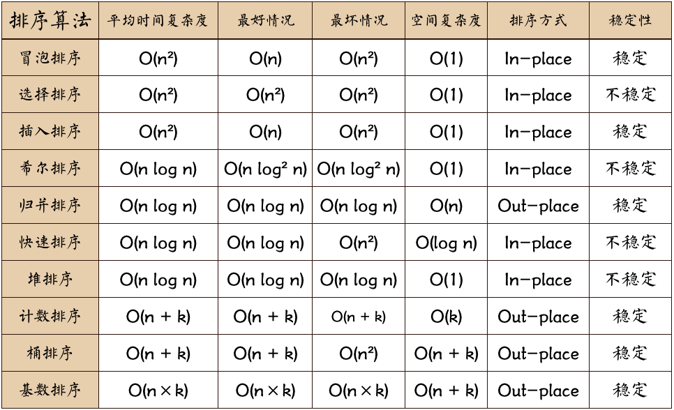

　　主要记录一些工具类

[TOC]

### 1 [排序工具](../java/com/ckm/tools/SortTool.java)
问题描述：

　　主要实现一些对于List的排序工具。如下图所示，

　　比较排序：常见的快速排序、归并排序、堆排序、冒泡排序等属于比较排序。
在排序的最终结果里，元素之间的次序依赖于它们之间的比较。每个数都必须和其他数进行比较，才能确定自己的位置。

　　非比较排序：计数排序、基数排序、桶排序则属于非比较排序。非比较排序是通过确定每个元素之前，应该有多少个元素来排序。
针对数组arr，计算`arr[i]`之前有多少个元素，则唯一确定了`arr[i]`在排序后数组中的位置。
非比较排序只要确定每个元素之前的已有的元素个数即可，所有一次遍历即可解决。算法时间复杂度`O(n)`。

解法：

　　1、冒泡排序

　　冒泡排序可以将元素当成泡泡，每一轮都会将当前未处理数据中的最小元素上浮到顶部。
从数组最后一个元素开始遍历，每次与前一个元素进行比较，小的元素往前调整，即泡泡不停往上移动。

　　时间复杂度，最佳情况：`T(n) = O(n)`   最差情况：`T(n) = O(n2)`   平均情况：`T(n) = O(n2)`

　　2、选择排序

　　将数组分为有序区和无序区，初始状态下有序区为0，数据全部在无序区。每次从无序区中选择最小元素移入有序区的尾部。
遍历完的最终状态是元素全在有序区，无序区大小为0.

　　时间复杂度`O(n2)`

　　3、插入排序

　　插入排序的过程可以理解为打扑克牌时调整牌序的过程。每次从牌堆中摸一张牌，放入手上已排好序的牌中指定位置，从插入位置开始，后面的元素整体后移一位。需要一个额外空间存储元素。
和选择排序一样，也分为一个有序空间和无序空间。

　　时间复杂度，最佳情况：`T(n) = O(n)`   最坏情况：`T(n) = O(n2)`   平均情况：`T(n) = O(n2)`

　　4、希尔排序

　　插入排序在数据规模小，或者数据基本有序的情况下会提高效率，有序程度越高排序的效率也就越高。基于这个特性加以改进就可以得到希尔排序。

　　希尔排序是改进版的插入排序，希尔排序又叫缩小增量排序。通过增量序列将数组逻辑上进行分组，每次在分组上进行插入排序。当增量减小到1时，即对整个数组进行排序。

　　增量序列一般用`{n / 2, (n / 2) / 2, ..., 1}`，即刚开始时为数组长度的一半，在刚开始的时候分组内的元素很少，可以提高插入排序的效率。
当增量逐渐变小，分组中的元素变多后，由于之前已经做过了排序，数据此时又是部分有序状态，仍然能够比较高效的排序。

　　时间复杂度，最佳情况：`T(n) = O(nlog2 n)`  最坏情况：`T(n) = O(nlog2 n)`  平均情况：`T(n) =O(nlog2n)`

　　5、插入排序